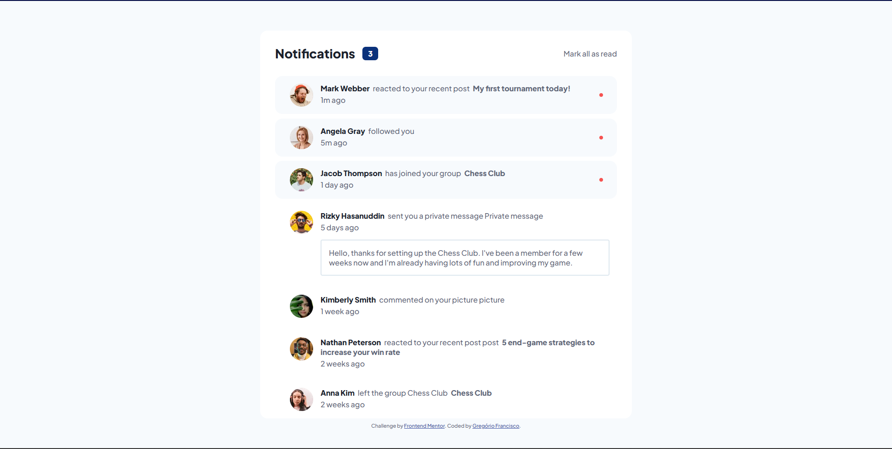

# Frontend Mentor - Notifications page solution

This is a solution to the [Notifications page challenge on Frontend Mentor](https://www.frontendmentor.io/challenges/notifications-page-DqK5QAmKbC). Frontend Mentor challenges help you improve your coding skills by building realistic projects. 

## Table of contents

- [Overview](#overview)
  - [The challenge](#the-challenge)
  - [Screenshot](#screenshot)
  - [Links](#links)
- [My process](#my-process)
  - [Built with](#built-with)
  - [What I learned](#what-i-learned)
  - [Continued development](#continued-development)
  - [Useful resources](#useful-resources)
- [Author](#author)
- [Acknowledgments](#acknowledgments)

## Overview

### The challenge

Users should be able to:

- Distinguish between "unread" and "read" notifications
- Select "Mark all as read" to toggle the visual state of the unread notifications and set the number of unread messages to zero
- View the optimal layout for the interface depending on their device's screen size
- See hover and focus states for all interactive elements on the page

### Screenshot



### Links

- Solution URL: [Add solution URL here](https://notificationspage.vercel.app/)

### Built with

- Semantic HTML5 markup
- CSS custom properties
- Flexbox
- CSS Grid
- Mobile-first workflow

### What I learned

With this project I put my JavaScrips knownlodge on test. I needed a solution for that would read the data inside my Objects and chance it's value (for the **Note: "Mark all read"** functionality) and I ended up with the following code:
...
```js	
Object.entries(document.getElementsByClassName('row')).forEach(row => {
    row[1]
    .classList
    .remove('unread')
  });
```
...


### Continued development

For my future projects, I want to be able to use ReactJS

### Useful resources

- [Convert an Object to an Array in JavaScript](https://www.javascripttutorial.net/object/convert-an-object-to-an-array-in-javascript/) - This is an amazing article which helped get unstucked in a crucial moment of my code. I'd recommend it to anyone still learning this concept.

## Author

- Website - [Gregório Francisco](https://www.linkedin.com/in/gregoriofrancisco99/)
- Frontend Mentor - [@gregoriofrancisco99](https://www.frontendmentor.io/profile/gregoriofrancisco99)
- Twitter - [@gregoriofranc99](https://twitter.com/gregoriofranc99)